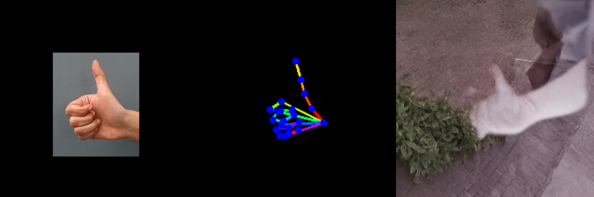
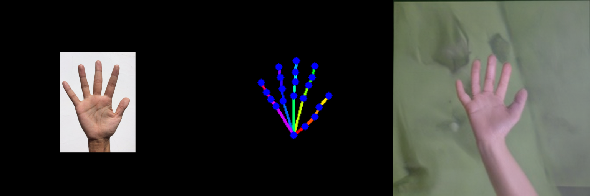
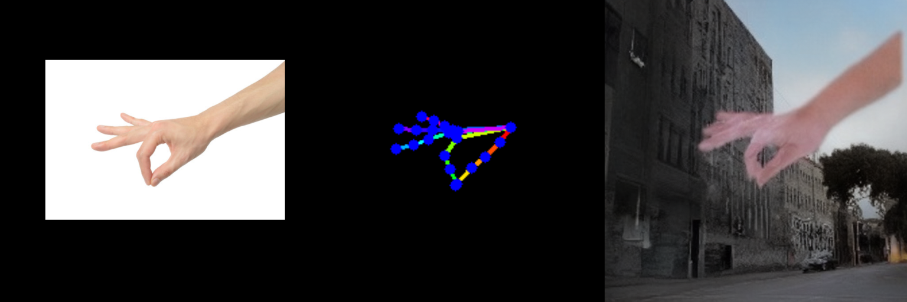

# SD 3.5 Hand Pose ControlNet
This repo provides SD3.5 hand pose ControlNet.
Official SD3.5 does not provide pose ControlNet.
We add a hand pose controlnet on top of their implementation.

This is a PoC project, so we keep the system minimal.
Note that the quality is not at the production level.

## Setup
```
conda create -n posectrl python=3.12.1 -y
conda activate posectrl

pip install torch==2.7.1 torchvision==0.22.1 torchaudio==2.7.1 --index-url https://download.pytorch.org/whl/cu126

pip install -r requirements.txt

pip install numpy==1.26.0 scipy==1.15.3

git clone https://github.com/Stability-AI/sd3.5.git
```

Huggingface login:
```
# huggingface login
python
import huggingface_hub
huggingface_hub.login()
```

Download models:
```py
python download_models.py
```

## Model Card
Huggingface: [uyoung-jeong/sd3.5-handpose-controlnet](https://huggingface.co/uyoung-jeong/sd3.5-handpose-controlnet)

```py
from huggingface_hub import snapshot_download
snapshot_download("uyoung-jeong/sd3.5-handpose-controlnet", local_dir="models/sd3.5-handpose-controlnet")
```

Local model paths:
```
models
├─ sd3.5_large.safetensors
...
└─ sd3.5-handpose-controlnet
   ├─ diffusion_pytorch_model.safetensors
   └─ config.json
```

## Training Dataset
- FreiHAND train
  - base dir: data/FreiHAND/training
  - GT images: data/FreiHAND/training/rgb
  - pose condition images: data/FreiHAND/training/pose
  - GT mask: data/FreiHAND/training/mask

## Input Condition
- Follows SD2.1 pose ControlNet (OpenPose format)

## Evaluation
- FreiHAND test
  - base dir: data/FreiHAND/evaluation
  - GT images: FreiHAND/evaluation/rgb
  - pose condition images: data/FreiHAND/evaluation/pose
  - GT mask: data/FreiHAND/evaluation/mask

Evaluation metrics:
- WiLoR detector: mean max-confidence, detection rate @0.3, True Positive fraction.

## Inference
In-the-wild image input:
- Run WiLoR detector
- Run WiLoR hand pose estimator
- Render a hand pose condition image
- Generate pose-conditioned images with our controlnet

## Results
Evaluation results:

```
metric             generated   gt-baseline
n                        200           200
mean_max_conf         0.7781        0.8518
det_rate@0.3          1.0000        1.0000
right_frac            1.0000        1.0000
```

Inference results:

input hand crop / pose condition / generated image.






